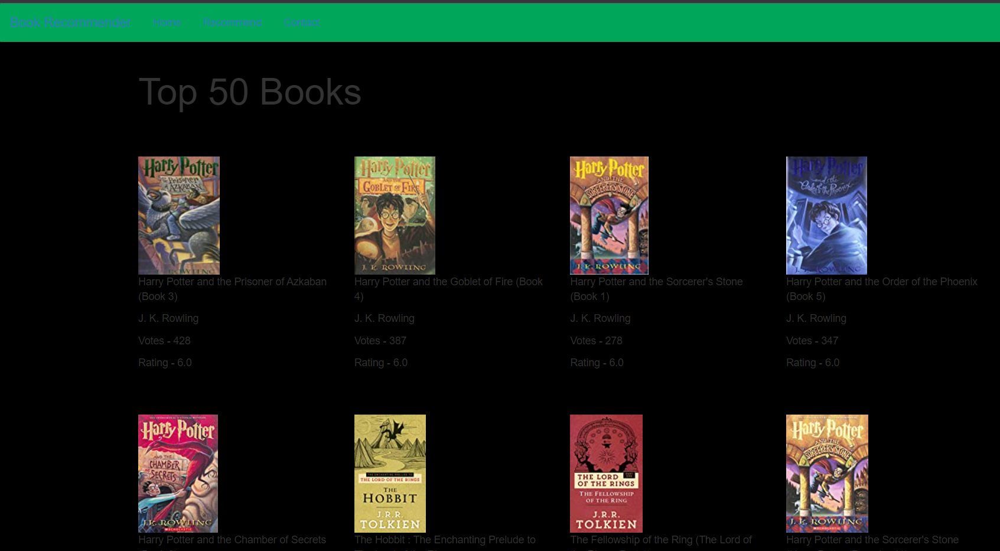
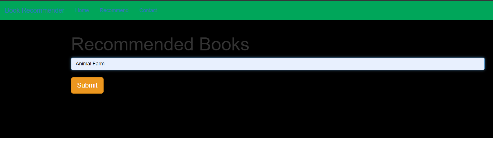
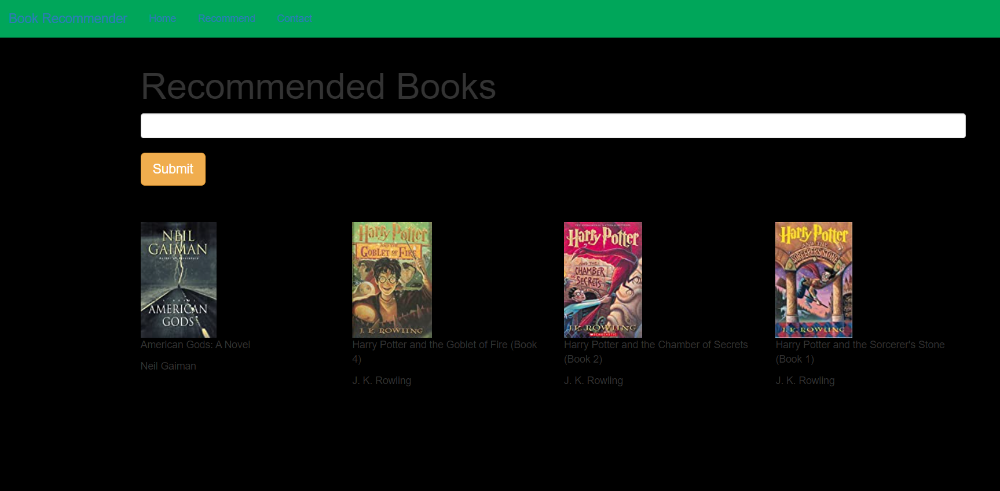

# Recommendation System

This model can recommends users according to their overall product ratings with predictive modeling and also recommends according to collaborative modeling which suggest similar object Recommendation.

## Demo

### API Reference
Bootstrap and Flask with Pycharm IDE.

## Used By
A recommender system, or a recommendation system, is a subclass of information filtering system that provide suggestions for items that are most pertinent to a particular user.

## Tech Stack
Client **Git**

Libraries used: Pandas, Numpy, flask, pickle etc.

